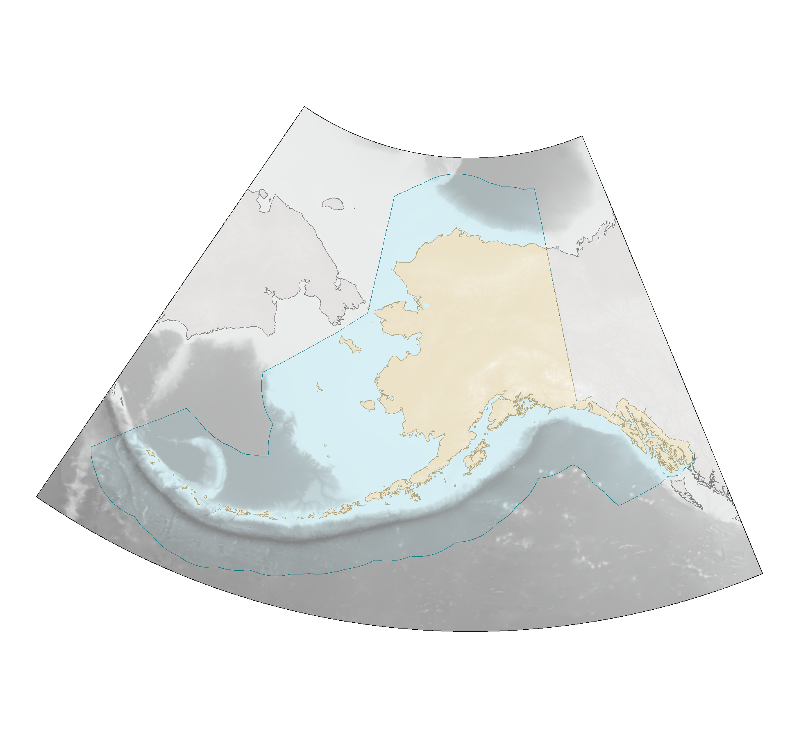

# Basemaps with ARDEM 2.0


# Introduction

Creating a map of Alaska is a pain. This demo illustrates a minimal
basemap workflow built on two geospatial resources. The first resource
is a specialized digital elevation model, ARDEM 2.0, developed by
researchers at the University of Alaska, Fairbanks (et al.). The second
resource is a specialized equal-area conic projection, Alaska Albers
(EPSG 3338).

# Results



# References

Danielson, S. L., Dobbins, E. L., Jakobsson, M., Johnson, M. A.,
Weingartner, T. J., Williams, W. J., & Zarayskaya, Y. (2015). Sounding
the northern seas. *Eos*, 96(10.1029).

Flanders Marine Institute (2023). Maritime Boundaries Geodatabase:
Maritime Boundaries and Exclusive Economic Zones (200NM), Version 12.
Available online at https://www.marineregions.org/.
https://doi.org/10.14284/632.

Office for Coastal Management, 2024: Coastal States,
https://www.fisheries.noaa.gov/inport/item/66116.

# Work

``` r
# Get packages.

library(sf) # vector manipulation
library(nngeo) # specialized vector operations
library(ggplot2) # plotting
library(dplyr) # data manipulation
library(magrittr) # pipes

# Get newer packages, try learning something for once.

library(terra)
library(tidyterra)

# Get one more package to set up overlaid figures.

library(cowplot)

# Get raster.

dat_raster = 
  "data/ARDEMv2.0.nc" %>% 
  rast %>% 
  filter(x > 166, x < 232, y > 47, y < 75.75) %>% # Pick bounds by hand.
  trim %>% 
  project("EPSG:3338")

# Get vectors.

#  Alaska's state boundaries retrieved from marinecadastre.gov, provided by BOEM and NOAA.

vec_alaska = 
  "data/Coastal_States" %>% 
  read_sf %>% 
  filter(statename == "Alaska") %>% 
  transmute(state = "Alaska") %>%  
  st_transform("EPSG:3338") %>% 
  st_union

#  EEZ boundaries off Alaska retrieved from marineregions.org, provided by the Flanders Marine Institute.

vec_eez = 
  "data/World_EEZ_v12_20231025" %>% 
  read_sf(layer = "eez_v12") %>% 
  filter(SOVEREIGN1 == "United States") %>% 
  filter(stringr::str_sub(GEONAME, -7, -2) == "Alaska") %>% 
  transmute(state = "Alaska") %>%  
  st_transform("EPSG:3338")

# Mask the raster of interest.

dat_mask = 
  st_union(vec_alaska, vec_eez) %>% 
  st_buffer(1) %>% 
  st_remove_holes %>% # nngeo
  vect # terra

dat_mask_raster = 
  dat_mask %>% 
  rasterize(dat_raster,
            touches = TRUE)

# Mask extents, US EEZ and all land in Alaska, all land, and all land in Alaska.

# Extents

dat_mask_ext = 
  dat_raster %>% 
  mutate(z = ifelse(is.na(z), NA, 1)) %>% 
  as.polygons(aggregate = TRUE)

# US EEZ and all land in Alaska

dat_us = 
  dat_raster %>% 
  mask(dat_mask_raster)

# Land

dat_mask_land = 
  dat_raster %>% 
  filter(z > 0) %>% 
  mutate(z = ifelse(is.na(z), NA, 1)) %>% 
  as.polygons(aggregate =  TRUE) %>% 
  fillHoles

# Land in Alaska

dat_mask_ak = 
  dat_us %>% 
  filter(z > 0) %>% 
  mutate(z = ifelse(is.na(z), NA, 1)) %>% 
  as.polygons(aggregate =  TRUE) %>% 
  fillHoles

# Mask everywhere else.

dat_them = 
  dat_raster %>% 
  mask(dat_mask, inverse = TRUE)

# Work out a palette scaled to elevations of itnerest.

elevation_max = minmax(dat_raster)[[2]]
elevation_min = minmax(dat_raster)[[1]]
elevation_vec = c(elevation_min, 
                  0, 
                  1, 
                  elevation_max)
elevation_us = c("grey50",
                 "#D8F0F5", # "#90DAEE",
                 "#EBE2C8", # "#BCF0D1",
                 "white")
elevation_them = c("grey50",
                   colorspace::desaturate("#D8F0F5", 0.95),
                   colorspace::desaturate("#EBE2C8", 0.95),
                   "white")

# Get a visualization in NOAA Coast Survey colors. 

#  Visualize Alaska and the US EEZ.

vis_us = 
  ggplot() +
  geom_spatraster(data = dat_us,
                  maxcell = Inf) + # This prevents resampling, improving resolution at a performance cost.
  geom_spatvector(data = dat_mask,
                  color = colorspace::darken("#D8F0F5", 0.50),
                  fill = NA) +
  geom_spatvector(data = dat_mask_ak,
                  color = colorspace::darken("#EBE2C8", 0.25),
                  fill = NA) +
  scale_fill_gradientn(limits = c(elevation_min, elevation_max),
                       breaks = c(elevation_min, 0, elevation_max),
                       values = scales::rescale(elevation_vec),
                       colors = elevation_us,
                       na.value = "transparent",
                       guide = 
                         guide_colorbar(direction = "horizontal",
                                        position = "bottom",
                                        frame.colour = "black",
                                        ticks.colour = NA)) +
  labs(fill = "Meters From Sea Level") +
  theme_void() +
  theme(legend.position = "none") # Legend is sort of implemented but also hidden.

#  Visualize everywhere else.

vis_them = 
  ggplot() +
  geom_spatraster(data = dat_them,
                  maxcell = Inf) +
  geom_spatvector(data = dat_mask_land,
                  color = "grey50",
                  fill = NA) +
  geom_spatvector(data = dat_mask_ext,
                  color = "black",
                  fill = NA) +
  scale_fill_gradientn(limits = c(elevation_min, elevation_max),
                       breaks = c(elevation_min, 0, elevation_max),
                       values = scales::rescale(elevation_vec),
                       colors = elevation_them,
                       na.value = "transparent",
                       guide = 
                         guide_colorbar(direction = "horizontal",
                                        position = "bottom",
                                        frame.colour = "black",
                                        ticks.colour = NA)) +
  labs(fill = "Meters From Sea Level") +
  theme_void() +
  theme(legend.position = "none") # Legend is sort of implemented but also hidden.

#  Combine for export.

vis = 
  ggdraw() +
  draw_plot(vis_them) +
  draw_plot(vis_us)

# Export.

ggsave("vis.png",
       vis,
       dpi = 300,
       width = 6.5,
       height = 6.0,
       bg = "transparent")
```
